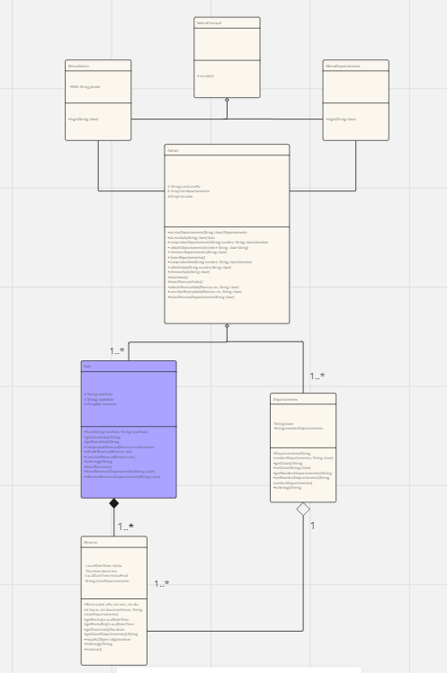

# Proyecto2Trim
## Asignatura: Programación
## Proyecto 2º Trimestre - Reserva de Salas

### MIEMBROS DEL PROYECTO:
+ Javier Medina Sanguino
+ Álvaro Guerrero Fernández

Accede a este enlace si la imagen no se aprecia bien:

[Enlace al tablero de Miró](https://miro.com/app/board/uXjVNklEdUM=/?share_link_id=831414358803)

